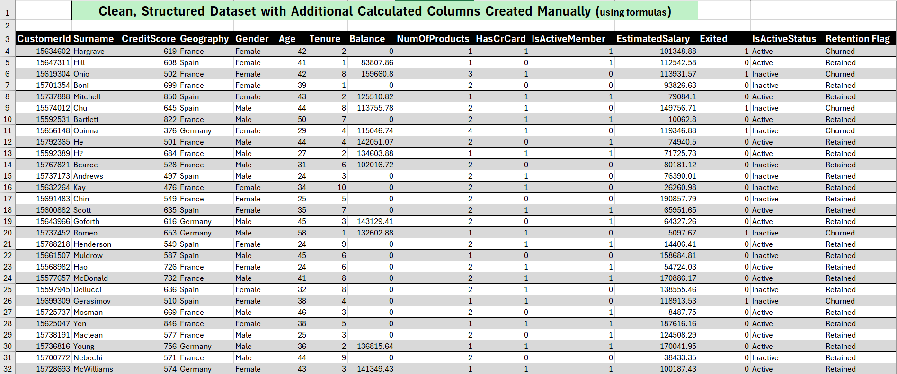
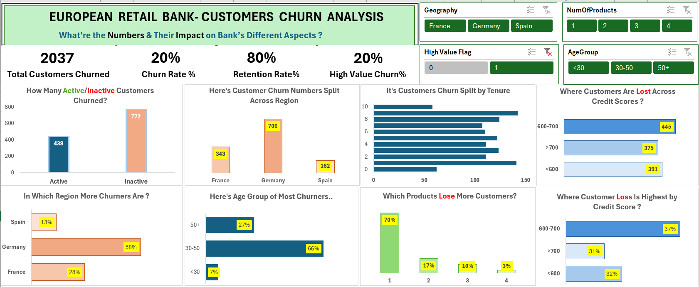

# European Retail Bank Customer Churn Analysis

Data analysis project on customer churn for a European retail bank using Excel dashboards to uncover retention patterns, churn drivers, and customer profile insights.

---

## Project Overview
This project analyzes **customer churn behavior** across geography, age, credit score, and product engagement using the **Maven Analytics Bank Customer Churn dataset**.  
It includes **3 dashboards** designed for different stakeholder perspectives:
1. **Overview Dashboard** – Customer Success / Retention Team view  
2. **Trends Dashboard** – Retention %, Active Members %, High‑Value Churn %  
3. **Customer Profile Drill‑Down Dashboard** – Average values segmented by dimensions (Geo, Age, Credit Score, Products)

---

##  Problem Statement
The bank faces a **20% churn rate**, with significant loss among high‑value customers.  
Objective: Identify **who churns, why they churn**, and **which segments need retention focus**.

---

##  Dataset
- **Source:** Maven Analytics – Bank Customer Churn dataset    
- **Key Fields:** CustomerID, Geography, Age, CreditScore, Balance, NumOfProducts, Tenure, IsActiveMember, ChurnFlag, EstimatedSalary  
- **Records:** 10,000 customers (France, Germany, Spain)

- 

---

##  Tools & Skills
- **Microsoft Excel** (Pivot Tables, Charts, KPI Cards)  
- **Visualization & Storytelling**
- **Dashboard Design**  
- **KPI Identification & Dimensions Mapping**  
- **Analytical Skills:** Churn %, Retention %, Active Member %, High‑Value Churn %, Product Engagement  

---

##  Methods
- Data cleaning and preparation in Excel  
- KPI calculation using Pivot Tables  
- Segmentation by Geography, Age, Credit Score, Product Count  
- Comparative analysis of churn vs. retention metrics  
- Dashboard design for multi‑stakeholder storytelling  

---

##   Key Insights
- **Churn Overview:**  
  - Total churners: **2037 (20%)**; retention rate: **80%**  
  - **Germany** shows the highest churn (**58%**) among regions.  
  - **Most churners aged 30–50 (66%)**, indicating mid‑career attrition.  
  - **Customers with one product** account for **70% of total churn**.  
  - **Credit score 600–700** group has the **highest loss (37%)**.  

- **Retention & Active Members:**  
  - **Active members:** 52% overall; **Germany** leads with 40%.  
  - **Products with highest retention:** Product 1 (66%) and Product 2 (31%).  
  - **Age group 30–50** has the most active customers (68%).  

- **High‑Value Customers (Balance >100k):**  
  - **20% churn rate** among high‑value customers.  
  - **Germany** loses the most high‑value customers (58%).  
  - **Credit score 600–700** again shows the highest churn concentration (37%).  

- **Customer Profile Drill‑Down:**  
  - Avg churner tenure: ~5 years; slightly higher for 3–4 products.  
  - Avg churner balance highest in **Spain (143k)**.  
  - Avg product count per customer highest in **Germany (1.51)**.  

---

##  Dashboards 
1. **Overview Dashboard:**  
   - Total churn, churn rate %, retention %, high‑value churn %, regional and age splits.  
2. **Trends Dashboard:**  
   - Retention %, Active Member %, High‑Value Churn %, product‑wise and region‑wise retention.  
3. **Customer Profile Drill‑Down Dashboard:**  
   - Avg tenure, balance, and product count segmented by Geo, Age, Credit Score, and Product Count.  

---

##  How to Use This Project
1. Download the repository  
2. Open `European-bank-churn-analysis.xlsx` in Excel.
3. Go to the Dashboard Worksheet. 
4. Explore KPI cards and slicers for interactive filtering  
5. Review insights summarized in this README  

---

##  Results & Final Recommendations
- **Germany** is the critical churn hotspot; targeted retention programs needed.  
- **Single‑product customers** are most vulnerable — cross‑selling can reduce churn.  
- **Mid‑age (30–50)** customers show both high churn and high engagement — retention incentives should focus here.  
- **Credit score 600–700** segment requires credit‑risk review and personalized offers.  
- **High‑value customers** need proactive relationship management to prevent revenue loss.

---

##  Future Work
- Extend analysis with SQL.  
- Build Power BI / Tableau interactive dashboards.  
- Apply predictive ML modeling for churn prediction.  

---

##  Author & Contact
**Ankita Sharma** 
 - Aspiring Business Analyst
- Email: ankita.analysis@outlook.com
- [LinkedIn](http://www.linkedin.com/in/ankitaa-s)
- [GitHub](https://github.com/AnkitaAnalysis)
